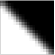

#Is Antialiasing Enabled? For WebGL

You probably heard about WebGL context ```antialias``` property. The interesting fact about it is that having this property as a `true` does not guarantee antialiasing to be actually enabled. It works just a as a hint for browser but there are many reasons it might be disabled and you d like to react on this. For example by enabling shader-based FSAA.

With this library you can actually check if AA works for this machine. Once executed it adds ```window.antialiasingSupported: boolean``` property which is ```true``` if AA is available.

##Installation

```npm install isantialiasingenabled```

##How this works?
Simple. 

Library creates detached canvas and draws triangle on it.



If triangle have any pixels except white and black then it is antialiased and ```window.antialiasingSupported``` is set to ```true```.

##License

MIT: http://mit-license.org/

Copyright 2018 Denis Radin aka [PixelsCommander](http://pixelscommander.com)

Inspired by my work at Evolution Gaming
[Evolution Gaming](https://www.evolutiongamingcareers.com/search-jobs/?department=Engineering&country=)